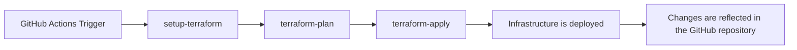

# terraform-github

## 概要

このリポジトリはTerraformとGitHub Actionsを使用してGitHubにリポジトリデプロイするためのものです。

## デプロイフロー

1. GitHub Actionsのワークフローがトリガーされます（例えば、プルリクエストがマージされたとき）。
2. [`set-matrix`](.github/actions/set-matrix/action.yml)アクションが実行され、Terraformの実行対象ディレクトリのリストを作成します。
3. [`setup-terraform`](.github/actions/setup-terraform/action.yml)アクションが実行され、Terraformをセットアップします。
4. [`terraform-plan`](.github/actions/terraform-plan/action.yml)アクションが実行され、Terraformの計画が作成されます。
5. [`terraform-apply`](.github/actions/terraform-apply/action.yml)アクションが実行され、Terraformの計画が適用されます。

