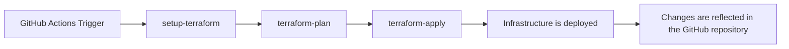

# terraform-github

## Overview

This repository is for deploying repositories to GitHub using Terraform and GitHub Actions.

## Deployment Flow

1. A GitHub Actions workflow is triggered (e.g., when a pull request is merged).
2. The [`set-matrix`](.github/actions/set-matrix/action.yml) action is executed to create a list of directories for Terraform execution.
3. The [`setup-terraform`](.github/actions/setup-terraform/action.yml) action is executed to set up Terraform.
4. The [`terraform-plan`](.github/actions/terraform-plan/action.yml) action is executed to create a Terraform plan.
5. The [`terraform-apply`](.github/actions/terraform-apply/action.yml) action is executed to apply the Terraform plan.

## How to use the terraform-import workflow

This workflow is used to import existing GitHub repositories into Terraform management.

### Overview

- The `terraform-import` workflow allows you to import existing GitHub repositories and branch protection settings into the Terraform state.
- It is executed manually (`workflow_dispatch`) by specifying the target module name and repository name.

### Parameters

- `module`: Terraform module name (e.g., `local-workspace-provisioning`, `terraform-aws`, `boilerplate-saas`, etc.)
- `repo`: GitHub repository name (e.g., `local-workspace-provisioning`, `terraform-aws`, `boilerplate-saas`, etc.)

### Usage

1. Go to the Actions tab in GitHub and select the `Terraform Import` workflow.
2. Click the `Run workflow` button, enter the `module` and `repo` values, and start the workflow.
    - Example: `module` = `local-workspace-provisioning`, `repo` = `local-workspace-provisioning`
    - Example: `module` = `terraform-aws`, `repo` = `terraform-aws`
3. When the workflow completes, the specified repository information will be imported into the Terraform state.

### Notes

- For `module`, specify the module name under `terraform/src/repository/`.
- For `repo`, specify the repository name on GitHub.
- Make sure that `secrets.TERRAFORM_GITHUB_TOKEN` is set as required.
