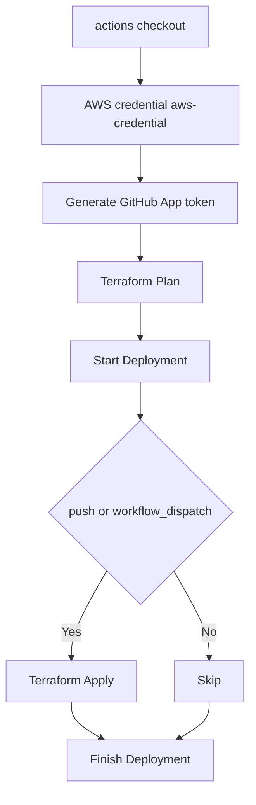
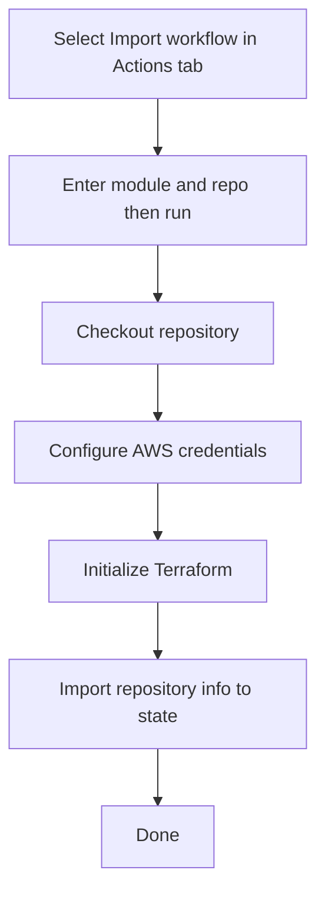

# terraform-github

## Overview

This repository is for deploying repositories to GitHub using Terraform and GitHub Actions.

## Getting Started

### Prerequisites

This project requires [Homebrew](https://brew.sh/) for macOS or Linux. All other dependencies will be installed automatically.

### Quick Setup

1. Install Homebrew and all required tools:

   ```bash
   make bootstrap
   ```

   This will install:
   - [just](https://github.com/casey/just) - Command runner
   - [mise](https://mise.jdx.dev/) - Universal tool version manager
   - [tflint](https://github.com/terraform-linters/tflint) - Terraform linter
   - [prek](https://prek.j178.dev/) - Pre-commit hook manager
   - [GitHub CLI](https://cli.github.com/)
   - [aws-vault](https://github.com/99designs/aws-vault) - AWS credential management

2. Restart your terminal or reload your shell (for Homebrew PATH)

3. Setup the development environment:

   ```bash
   just setup
   ```

   This will:
   - Install tools defined in `.tool-versions` via mise (Terraform v1.13.3)
   - Set up pre-commit hooks using prek
   - Initialize Terraform

### Verify Installation

Check that all required tools are installed:

```bash
just check-tools
```

### Development with Git Worktree

This project supports parallel development using git worktree. This allows you to work on multiple branches simultaneously without switching between them.

#### Setup Git Worktree

```bash
just worktree-setup
```

This will guide you through creating a new worktree. Worktrees are created in the parent directory with the pattern: `terraform-github-<branch-name>`

#### Manual Worktree Management

Create a new worktree:

```bash
# For a new branch
git worktree add ../terraform-github-feature-name -b feature/feature-name

# For an existing branch
git worktree add ../terraform-github-feature-name feature/feature-name
```

List all worktrees:

```bash
git worktree list
```

Remove a worktree:

```bash
git worktree remove ../terraform-github-feature-name
```

### Available Commands

#### Bootstrap (Makefile)

- `make bootstrap` - Install Homebrew and all required tools
- `make help` - Show Makefile targets

#### Development Tasks (just)

Show all available tasks:

```bash
just help
```

Common tasks:

- `just setup` - Setup development environment (install tools and initialize)
- `just check-tools` - Verify all required tools are installed
- `just worktree-setup` - Interactive git worktree setup
- `just fmt` - Format all Terraform files
- `just validate` - Validate Terraform configuration
- `just lint` - Run all linters (prek)
- `just init` - Initialize Terraform
- `just plan` - Run Terraform plan
- `just apply` - Run Terraform apply (use with caution)
- `just clean` - Clean Terraform temporary files
- `just version` - Show Terraform and tflint versions
- `just status` - Show mise-managed tool versions
- `just install` - Install tools from .tool-versions
- `just update` - Update mise-managed tools

## Deployment Flow

1. A GitHub Actions workflow is triggered (e.g., when a pull request is merged).
2. The [`set-matrix`](.github/actions/set-matrix/action.yml) action is executed to create a list of directories for Terraform execution.
3. The [`setup-terraform`](.github/actions/setup-terraform/action.yml) action is executed to set up Terraform.
4. The [`terraform-plan`](.github/actions/terraform-plan/action.yml) action is executed to create a Terraform plan.
5. The [`terraform-apply`](.github/actions/terraform-apply/action.yml) action is executed to apply the Terraform plan.



## How to use the terraform-import workflow

This workflow is used to import existing GitHub repositories into Terraform management.

### Overview

- The `terraform-import` workflow allows you to import existing GitHub repositories and branch protection settings into the Terraform state.
- It is executed manually (`workflow_dispatch`) by specifying the target module name and repository name.

### Flow



### Parameters

- `module`: Terraform module name (e.g., `local-workspace-provisioning`, `terraform-aws`, `boilerplate-saas`, etc.)
- `repo`: GitHub repository name (e.g., `local-workspace-provisioning`, `terraform-aws`, `boilerplate-saas`, etc.)

### Usage

1. Go to the Actions tab in GitHub and select the `Terraform Import` workflow.
2. Click the `Run workflow` button, enter the `module` and `repo` values, and start the workflow.
    - Example: `module` = `local-workspace-provisioning`, `repo` = `local-workspace-provisioning`
    - Example: `module` = `terraform-aws`, `repo` = `terraform-aws`
3. When the workflow completes, the specified repository information will be imported into the Terraform state.

### Notes

- For `module`, specify the module name under `terraform/src/repository/`.
- For `repo`, specify the repository name on GitHub.
- Make sure that `secrets.TERRAFORM_GITHUB_TOKEN` is set as required.
