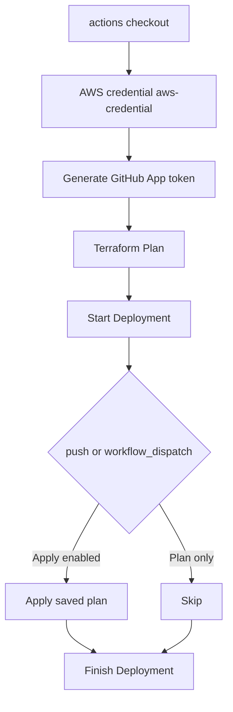
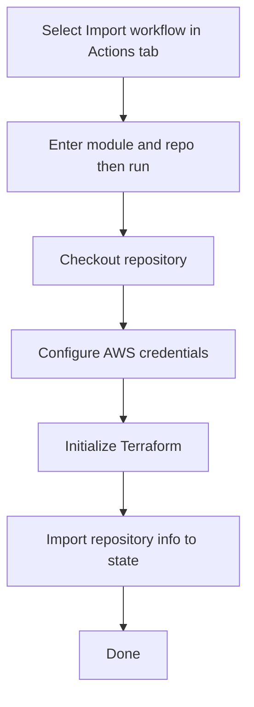

# terraform-github

## Overview

This repository is for deploying repositories to GitHub using Terraform and GitHub Actions.

## Getting Started

### Prerequisites

Install [mise](https://mise.jdx.dev/) and Git. The setup scripts support macOS and Linux.
If mise is missing, `./scripts/bootstrap.sh` installs Homebrew and the packages in `Brewfile`.

### Quick Setup

```bash
mise bootstrap --only tools,task
```

This installs the pinned tools in `mise.toml` (including pnpm and betterleaks),
Node.js development dependencies from the lockfile, and lefthook Git hooks.
`mise run bootstrap` runs the same repository setup task directly; `mise run setup`
remains available. In a non-interactive shell, set `CI=true` when replacing an existing
`node_modules` installation. Terraform backend initialization is a separate step
because it requires AWS credentials.

The betterleaks pre-commit hook scans the selected files from the Git index,
including partially staged files. `mise run lint` scans selected tracked files from
the working tree, runs regression tests, and runs all linters. Secret values are
redacted and live credential validation is disabled.

### Verify Installation

Check that all required tools are installed:

```bash
mise run check-tools
```

### Development with Git Worktree

This project supports parallel development using git worktree. This allows you to work on multiple branches simultaneously without switching between them.

#### Setup Git Worktree

```bash
mise run wt:setup
```

This will guide you through creating a new worktree. Worktrees are created under `.worktrees/<branch-name>/` within the repository.

#### Manual Worktree Management

Create a new worktree:

```bash
# For a new branch
git worktree add .worktrees/feature-name -b feature/feature-name

# For an existing branch
git worktree add .worktrees/feature-name feature/feature-name
```

List all worktrees:

```bash
git worktree list
```

Remove a worktree:

```bash
git worktree remove .worktrees/feature-name
```

### Available Commands

#### Bootstrap

- `mise bootstrap --only tools,task` - Install tools, development dependencies and Git hooks
- `./scripts/bootstrap.sh` - Install Homebrew and base packages when mise is missing

#### Development Tasks (mise)

Show all available tasks:

```bash
mise tasks
```

Common tasks:

- `mise run bootstrap` / `mise run setup` - Setup tools, development dependencies and Git hooks
- `mise run check-tools` - Verify all required tools are installed
- `mise run wt:setup` - Interactive git worktree setup
- `mise run tf:fmt` - Format all Terraform files
- `mise run tf:validate` - Validate Terraform configuration
- `mise run lint` / `mise run dev:lint` - Run regression tests and all linters
- `mise run dev:test` - Run regression tests
- `mise run tf:init` - Initialize Terraform
- `mise run tf:plan` - Run Terraform plan
- `mise run tf:apply` - Run Terraform apply (use with caution)
- `mise run tf:clean` - Clean Terraform temporary files
- `mise run version` - Show tool versions (Terraform, mise)
- `mise run status` - Show mise-managed tool versions
- `mise run install` - Install tools from mise.toml
- `mise run update` - Update mise-managed tools

## Deployment Flow

1. Pull requests and pushes select only changed repository roots. Shared repository module or Terraform action changes select all roots. Manual runs require a repository root name, or the explicit value `all`.
2. The [`set-matrix`](.github/actions/set-matrix/action.yml) action is executed to create a list of directories for Terraform execution.
3. The [`setup-terraform`](.github/actions/setup-terraform/action.yml) action is executed to set up Terraform.
4. The [`terraform-plan`](.github/actions/terraform-plan/action.yml) action is executed to create a Terraform plan.
5. Pushes affecting individual roots apply the saved plan. Shared module or Terraform action changes run plan only; apply them through a manual run after reviewing every affected root. Manual runs default to plan only; set `apply` to true after reviewing the target and expected changes.

Local Terraform tasks default to `terraform-github`. Select a root explicitly, for example:

```bash
AWS_PROFILE=portfolio mise run tf:init -- terraform-github -input=false
AWS_PROFILE=portfolio mise run tf:validate -- terraform-github
AWS_PROFILE=portfolio mise run tf:plan -- terraform-github -out=tfplan
mise exec -- terraform -chdir=terraform/src/repositories/terraform-github show tfplan
AWS_PROFILE=portfolio mise run tf:apply -- terraform-github tfplan
```

Set `TF_VAR_github_token` using your existing credential mechanism. Saved plans may
contain sensitive values and must remain untracked. `TERRAFORM_DIR` can override
the default root. Archived roots do not manage vulnerability alerts; existing
active alert resources migrate to the indexed address without recreation.


```mermaid
graph TD
  A[actions checkout] --> B[AWS credential aws-credential]
  B --> C[Generate GitHub App token]
  C --> D[Terraform Plan]
  D --> E[Start Deployment]
  E --> F{push or workflow_dispatch}
  F -- Apply enabled --> G[Apply saved plan]
  F -- Plan only --> H[Skip]
  G --> I[Finish Deployment]
  H --> I
```

## How to use the terraform-import workflow

This workflow is used to import existing GitHub repositories into Terraform management.

### Overview

- The `terraform-import` workflow allows you to import existing GitHub repositories and branch protection settings into the Terraform state.
- It is executed manually (`workflow_dispatch`) by specifying the target module name and repository name.

### Flow


```mermaid
graph TD
  A[Select Import workflow in Actions tab] --> B[Enter module and repo then run]
  B --> C[Checkout repository]
  C --> D[Configure AWS credentials]
  D --> E[Initialize Terraform]
  E --> F[Import repository info to state]
  F --> G[Done]
```

### Parameters

- `module`: Terraform module name (e.g., `local-workspace-provisioning`, `terraform-aws`, `boilerplate-saas`, etc.)
- `repo`: GitHub repository name (e.g., `local-workspace-provisioning`, `terraform-aws`, `boilerplate-saas`, etc.)

### Usage

1. Go to the Actions tab in GitHub and select the `Terraform Import` workflow.
2. Click the `Run workflow` button, enter the `module` and `repo` values, and start the workflow.
    - Example: `module` = `local-workspace-provisioning`, `repo` = `local-workspace-provisioning`
    - Example: `module` = `terraform-aws`, `repo` = `terraform-aws`
3. When the workflow completes, the specified repository information will be imported into the Terraform state.

### Notes

- For `module`, specify the module name under `terraform/src/repositories/`.
- For `repo`, specify the repository name on GitHub.
- Make sure that `secrets.TERRAFORM_GITHUB_TOKEN` is set as required.
