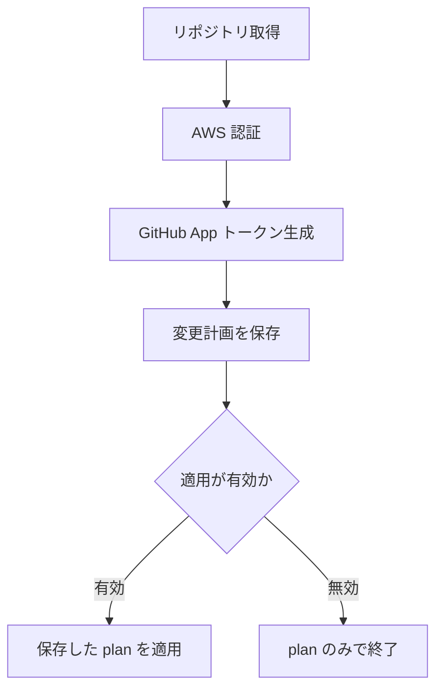

# terraform-github

## 概要

Terraform と GitHub Actions を使い、GitHub リポジトリの設定を管理します。
共通モジュールでリポジトリ、ブランチ保護、環境、Actions の権限を定義します。

## セットアップ

### 前提条件

[mise](https://mise.jdx.dev/) と Git を準備してください。
セットアップスクリプトは macOS と Linux に対応しています。
mise が未導入の場合は、次のスクリプトで Homebrew と `Brewfile` の基本ツールを導入します。

```bash
./scripts/bootstrap.sh
```

`Brewfile` は環境の起動に必要な mise と Git だけを管理します。
Terraform、aws-vault、Node.js、Python、pnpm、lefthook などは `mise.toml` で管理します。
文書の検証、JSON の整形、LLM 向けルールの生成に使う依存は `package.json` と
`pnpm-lock.yaml` で固定します。Git フックには lefthook を使います。

### 一括セットアップ

```bash
mise bootstrap --only tools,task
```

mise の固定ツール、ロックファイルに従った Node.js 依存、LLM 向けルールの参照、
lefthook の Git フックをセットアップします。
`mise run bootstrap` と `mise run setup` も同じセットアップを実行します。
非対話環境で既存の `node_modules` を置き換える場合は `CI=true` を指定してください。
AWS 認証が必要な Terraform バックエンドの初期化は、別途実行します。

### インストールの確認

```bash
mise run check-tools
```

### コード品質

betterleaks のコミットフックは、選択されたファイルの Git インデックスを検査します。
部分的にステージしたファイルも対象とし、秘密の値をマスクします。
外部 API による認証情報の有効性検証は行いません。
`mise run lint` はルールの生成結果、回帰テスト、全リントを検証します。
秘密検出の対象は、作業ツリー内の選択された追跡ファイルです。

JSON の整形には [Oxfmt](https://oxc.rs/docs/guide/usage/formatter.html) を使います。
Terraform の整形は `terraform fmt`、Markdown の検証は markdownlint、textlint、
cspell を使います。JavaScript / TypeScript のソースを持たないため、Oxlint は導入していません。

## LLM 向けルール

ルールごとに `docs/rules/*.md` を原本として管理します。
[プロジェクトの構成](docs/rules/project.md)、[開発作業](docs/rules/development.md)、
[コーディング規約](docs/rules/coding-standards.md)、
[文書の規約](docs/rules/documentation.md) を個別の文書に配置します。
Markdown 文書は日本語で記述し、言語別の複製を作りません。

[rulesync](https://rulesync.dyoshikawa.com/) で原本への参照を生成します。
対象は Claude Code、Codex、GitHub Copilot、Devin です。
Codex と Devin の入口は `AGENTS.md`、Copilot は `.github/copilot-instructions.md`、
Claude Code は `.claude/rules/*.md` です。
Copilot と Devin にも個別ルールを生成し、各ルールから対応する原本を参照します。
ルール以外の設定は生成しません。

```bash
mise run rules:sync
mise run rules:check
```

## Git worktree

複数のブランチを同時に作業する場合は Git worktree を使います。
対話形式のセットアップは次のコマンドで実行します。

```bash
mise run wt:setup
```

worktree はリポジトリ内の `.worktrees/<branch-name>/` に作成されます。
手動で管理する場合は、次のように操作します。

```bash
# 新しいブランチを作成する
git worktree add .worktrees/feature-name -b feature/feature-name

# 既存ブランチを使う
git worktree add .worktrees/feature-name feature/feature-name

# 一覧を確認する
git worktree list

# 削除する
git worktree remove .worktrees/feature-name
```

## 主要コマンド

全タスクは `mise tasks` で確認できます。

| コマンド | 用途 |
| --- | --- |
| `mise run bootstrap` / `mise run setup` | ツール、依存、ルール、Git フックのセットアップ |
| `mise run check-tools` | 必要なツールの確認 |
| `mise run wt:setup` | worktree の対話形式セットアップ |
| `mise run tf:fmt` | Terraform ファイルの整形 |
| `mise run tf:validate` | Terraform 設定の検証 |
| `mise run tf:init` | Terraform の初期化 |
| `mise run tf:plan` | 変更計画の作成 |
| `mise run tf:apply` | 変更の適用（対象と計画を事前に確認） |
| `mise run tf:clean` | Terraform の一時ファイル削除 |
| `mise run lint` / `mise run dev:lint` | 回帰テストと全リント |
| `mise run dev:test` | 回帰テスト |
| `mise run rules:sync` / `mise run rules:check` | LLM 向け参照の生成 / 更新漏れの確認 |
| `mise run version` / `mise run status` | バージョン / mise 管理ツールの確認 |
| `mise run install` / `mise run update` | mise 管理ツールの導入 / 更新 |

詳しい操作は [コマンドリファレンス](docs/commands-reference.md) を参照してください。

## デプロイの流れ

1. PR と push では、変更されたリポジトリの Terraform ルートだけを選択します。
   共通モジュールや Terraform 用 Action の変更は全ルートを選択します。
   手動実行ではルート名を指定し、全件対象にする場合は明示的に `all` を指定します。
2. [set-matrix](.github/actions/set-matrix/action.yml) が対象ディレクトリの一覧を生成します。
3. [setup-terraform](.github/actions/setup-terraform/action.yml) が Terraform を準備します。
4. [terraform-plan](.github/actions/terraform-plan/action.yml) が変更計画を作成します。
5. 個別ルートへの push は保存した plan を適用します。
   共通モジュールや Terraform 用 Action の変更は plan のみを実行し、
   各ルートの計画を確認した後で手動適用します。
   手動実行の既定は plan のみです。対象と計画を確認してから `apply=true` を指定します。

ローカルの既定対象は `terraform-github` です。引数で対象を明示できます。

```bash
AWS_PROFILE=portfolio mise run tf:init -- terraform-github -input=false
AWS_PROFILE=portfolio mise run tf:validate -- terraform-github
AWS_PROFILE=portfolio mise run tf:plan -- terraform-github -out=tfplan
mise exec -- terraform -chdir=terraform/src/repositories/terraform-github show tfplan
AWS_PROFILE=portfolio mise run tf:apply -- terraform-github tfplan
```

認証用の `TF_VAR_github_token` は既存の認証方法で設定します。
`TERRAFORM_DIR` で既定ルートを変更できます。
保存した plan は秘密を含む場合があるため Git に追加しません。
アーカイブ済みのルートでは脆弱性通知を管理しません。
既存の有効な通知リソースは `moved` で移行し、再作成を避けます。


```mermaid
graph TD
  A[リポジトリ取得] --> B[AWS 認証]
  B --> C[GitHub App トークン生成]
  C --> D[変更計画を保存]
  D --> E{適用が有効か}
  E -- 有効 --> F[保存した plan を適用]
  E -- 無効 --> G[plan のみで終了]
```

## 既存リポジトリのインポート

`terraform-import` ワークフローで既存の GitHub リポジトリを Terraform 管理下に取り込みます。
リポジトリやブランチ保護などを state に取り込む処理を、手動実行で開始します。

### パラメータ

- `module`: `terraform/src/repositories/` 配下の対象モジュール名
  （例: `local-workspace-provisioning`、`terraform-aws`、`boilerplate-saas`）
- `repo`: GitHub 上のリポジトリ名

### 手順

1. GitHub の Actions タブから `Terraform Import` を選択します。
2. `Run workflow` をクリックし、`module` と `repo` を入力して実行します。
   例: `module=terraform-aws`、`repo=terraform-aws`。
3. ワークフローが AWS 認証と Terraform の初期化を行い、指定したリポジトリを state に取り込みます。

必要な `secrets.TERRAFORM_GITHUB_TOKEN` が設定されていることを確認してください。
