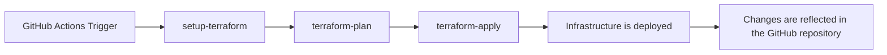

# terraform-github

## 概要

このリポジトリはTerraformとGitHub Actionsを使用してGitHubにリポジトリデプロイするためのものです。

## デプロイフロー

1. GitHub Actionsのワークフローがトリガーされます（例えば、プルリクエストがマージされたとき）。
2. [`set-matrix`](.github/actions/set-matrix/action.yml)アクションが実行され、Terraformの実行対象ディレクトリのリストを作成します。



## ローカルで `terraform plan` する方法

```shell
$AWS_PROFILE=XXXXXXXXXX
$PIPE_LINE=terraform/src/repository
aws-vault exec $AWS_PROFILE -- terraform -chdir=$PIPE_LINE init -reconfigure
aws-vault exec $AWS_PROFILE -- terraform -chdir=$PIPE_LINE validate
aws-vault exec $AWS_PROFILE -- terraform -chdir=$PIPE_LINE plan
aws-vault exec $AWS_PROFILE -- terraform -chdir=$PIPE_LINE apply -auto-approve
```
