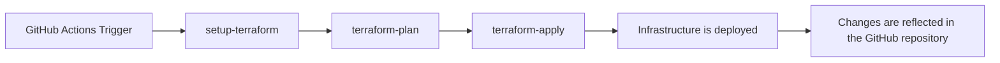
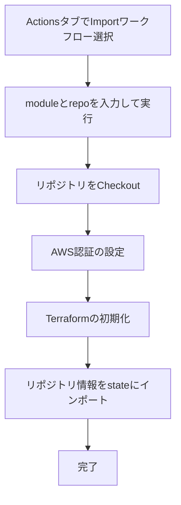

# terraform-github

## 概要

このリポジトリはTerraformとGitHub Actionsを使用してGitHubにリポジトリデプロイするためのものです。

## デプロイフロー

1. GitHub Actionsのワークフローがトリガーされます（例えば、プルリクエストがマージされたとき）。
2. [`set-matrix`](.github/actions/set-matrix/action.yml)アクションが実行され、Terraformの実行対象ディレクトリのリストを作成します。



## ローカルで `terraform plan` する方法

```shell
$AWS_PROFILE=XXXXXXXXXX
$PIPE_LINE=terraform/src/repository
aws-vault exec $AWS_PROFILE -- terraform -chdir=$PIPE_LINE init -reconfigure
aws-vault exec $AWS_PROFILE -- terraform -chdir=$PIPE_LINE validate
aws-vault exec $AWS_PROFILE -- terraform -chdir=$PIPE_LINE plan
aws-vault exec $AWS_PROFILE -- terraform -chdir=$PIPE_LINE apply -auto-approve
```

## terraform-import ワークフローの使い方

このワークフローは、既存のGitHubリポジトリをTerraform管理下にインポートするためのものです。

### 概要

- `terraform-import` ワークフローは、既存のGitHubリポジトリやブランチ保護設定などをTerraformのstateに取り込むために利用します。
- 手動実行（workflow_dispatch）で、対象のmodule名とリポジトリ名を指定して実行します。

### 処理フロー



### パラメータ

- `module`: Terraformモジュール名（例: `local-workspace-provisioning`, `terraform-aws`, `boilerplate-saas` など）
- `repo`: GitHubリポジトリ名（例: `local-workspace-provisioning`, `terraform-aws`, `boilerplate-saas` など）

### 実行手順

1. GitHubのActionsタブから`Terraform Import`ワークフローを選択します。
2. `Run workflow`ボタンを押し、`module`と`repo`を入力して実行します。
    - 例: `module` = `local-workspace-provisioning`, `repo` = `local-workspace-provisioning`
    - 例: `module` = `terraform-aws`, `repo` = `terraform-aws`
3. ワークフローが完了すると、指定したリポジトリの情報がTerraformのstateにインポートされます。

### 注意事項

- `module`には`terraform/src/repository/`配下の該当するモジュール名を指定してください。
- `repo`にはGitHub上のリポジトリ名を指定してください。
- 必要に応じて`secrets.TERRAFORM_GITHUB_TOKEN`が設定されていることを確認してください。
