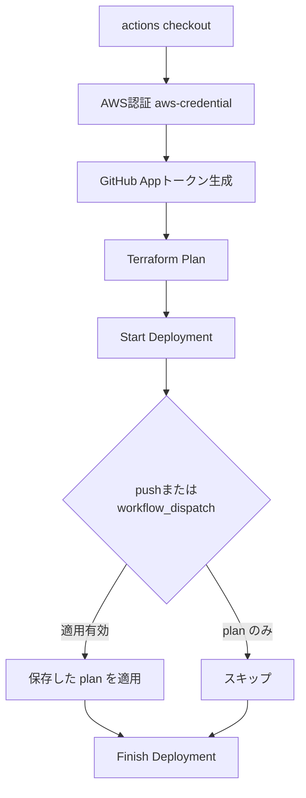
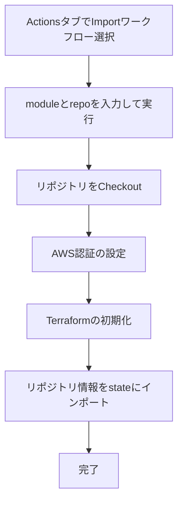

# terraform-github

## 概要

このリポジトリはTerraformとGitHub Actionsを使用してGitHubにリポジトリデプロイするためのものです。

## セットアップ

mise と Git を準備し、リポジトリ内で次を実行する。

```bash
mise bootstrap --only tools,task
```

mise 管理ツール、固定された pnpm 依存、lefthook をまとめてセットアップする。
mise が未導入の場合は `./scripts/bootstrap.sh` で Homebrew と基本ツールを導入する。
`mise run bootstrap` と従来の `mise run setup` も同じセットアップを実行する。
非対話環境で既存の `node_modules` を置き換える場合は `CI=true` を指定する。
AWS 認証が必要な Terraform 初期化は別途行う。

betterleaks はコミット時に選択されたファイルの Git index を検査する。
部分的にステージした秘密も検出し、値はマスクする。外部 API での認証確認は無効。
`mise run lint` は作業ツリーの選択された追跡ファイル、回帰テスト、全 lint を検証する。

## デプロイフロー

1. GitHub Actionsのワークフローがトリガーされます（例えば、プルリクエストがマージされたとき）。
2. [`set-matrix`](.github/actions/set-matrix/action.yml)アクションが実行され、Terraformの実行対象ディレクトリのリストを作成します。


```mermaid
graph TD
  A[actions checkout] --> B[AWS認証 aws-credential]
  B --> C[GitHub Appトークン生成]
  C --> D[Terraform Plan]
  D --> E[Start Deployment]
  E --> F{pushまたはworkflow_dispatch}
  F -- 適用有効 --> G[保存した plan を適用]
  F -- plan のみ --> H[スキップ]
  G --> I[Finish Deployment]
  H --> I
```

## 実行対象とローカル plan

PR と main push は変更された root だけを対象にする。
共通モジュールまたは Terraform 用 Action の変更は全 root の plan のみを実行する。
共通変更の適用は、各 root の plan を確認した後に手動実行で明示する。
手動実行では `repository` に root 名を指定し、全件実行には明示的に `all` を指定する。
`apply` の既定値は false で、まず plan と対象を確認する。
適用する場合は対象と変更内容を確認した上で true を指定する。
各 job は、その実行で保存した plan を適用する。

ローカルタスクの既定対象は `terraform-github`。引数で別の root を指定できる。
認証用の `TF_VAR_github_token` は既存の認証方法で設定する。

```bash
AWS_PROFILE=portfolio mise run tf:init -- terraform-github -input=false
AWS_PROFILE=portfolio mise run tf:validate -- terraform-github
AWS_PROFILE=portfolio mise run tf:plan -- terraform-github -out=tfplan
mise exec -- terraform -chdir=terraform/src/repositories/terraform-github show tfplan
AWS_PROFILE=portfolio mise run tf:apply -- terraform-github tfplan
```

`TERRAFORM_DIR` で既定 root を変更することも可能。
保存した plan は秘密を含む場合があるため、Git に追加しない。
archived の root は vulnerability alerts リソースを作成しない。
既存の非 archived リソースは `moved` で移行し、再作成を避ける。

## terraform-import ワークフローの使い方

このワークフローは、既存のGitHubリポジトリをTerraform管理下にインポートするためのものです。

### 概要

- `terraform-import` ワークフローは、既存のGitHubリポジトリやブランチ保護設定などをTerraformのstateに取り込むために利用します。
- 手動実行（workflow_dispatch）で、対象のmodule名とリポジトリ名を指定して実行します。

### 処理フロー


```mermaid
graph TD
  A[ActionsタブでImportワークフロー選択] --> B[moduleとrepoを入力して実行]
  B --> C[リポジトリをCheckout]
  C --> D[AWS認証の設定]
  D --> E[Terraformの初期化]
  E --> F[リポジトリ情報をstateにインポート]
  F --> G[完了]
```

### パラメータ

- `module`: Terraformモジュール名（例: `local-workspace-provisioning`, `terraform-aws`, `boilerplate-saas` など）
- `repo`: GitHubリポジトリ名（例: `local-workspace-provisioning`, `terraform-aws`, `boilerplate-saas` など）

### 実行手順

1. GitHubのActionsタブから`Terraform Import`ワークフローを選択します。
2. `Run workflow`ボタンを押し、`module`と`repo`を入力して実行します。
    - 例: `module` = `local-workspace-provisioning`, `repo` = `local-workspace-provisioning`
    - 例: `module` = `terraform-aws`, `repo` = `terraform-aws`
3. ワークフローが完了すると、指定したリポジトリの情報がTerraformのstateにインポートされます。

### 注意事項

- `module`には`terraform/src/repositories/`配下の該当するモジュール名を指定してください。
- `repo`にはGitHub上のリポジトリ名を指定してください。
- 必要に応じて`secrets.TERRAFORM_GITHUB_TOKEN`が設定されていることを確認してください。
